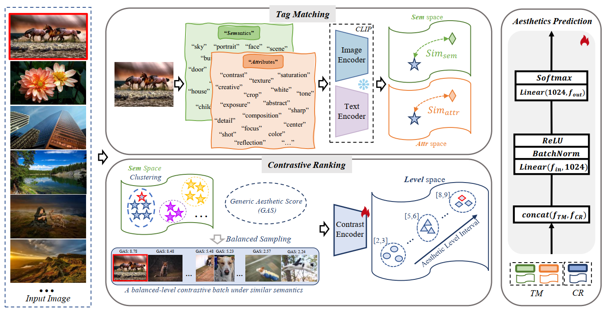

<h1 align="center">Semantics-Aware Image Aesthetics Assessment using Tag Matching and Contrastive Ranking</h1>

<div align="center">
    <a href="https://github.com/yzc-ippl/" target="_blank">Zhichao Yang</a><sup>1</sup>,
    <a href="https://web.xidian.edu.cn/ldli/" target="_blank">Leida Li</a><sup>1*</sup>,
    <a href="#" target="_blank">Pengfei Chen</a><sup>1</sup>,
    <a href="#" target="_blank">Jinjian Wu</a><sup>1</sup>,
    <a href="#" target="_blank">Weisheng Dong</a><sup>1</sup>,
</div>

<div align="center">
  <sup>1</sup>School of Artificial Intelligence, Xidian University
</div>

<div align="center">
<sup>*</sup>Corresponding author
</div>

<div align="center">
  
</div>


## Introduction：
### PyTorch implementation for the [paper](https://dl.acm.org/doi/abs/10.1145/3664647.3680972)  

### Model weight：[model](https://pan.baidu.com/s/13WDBJnBgHBvXUuODI4K1mw?pwd=4rd8)


## Inference Guide：

### 1. Directory Structure
```
   project_root/
├── AVA/
│   └── Image/                       # AVA dataset images
│   └── Label/                       # AVA dataset labels
├── TM/
│   └── Attr_Tags.csv                 # Aesthetic attribute Tags
│   └── Attr_Tags.csv                 # Sementic attribute Tags
│   └── TM_AVA.py                     # Extract TM Features
├── CR/
│   └── CR_AVA.py                     # Extract CR Features (Training)
├── TMCR/
│   └── TMCR.py                       # Testing TMCR on AVA
```
### 2. Download Pretrained Model Weight
```
Swin-B Pretrained Weights: Place in ./Model/swin_b-68c6b09e.pth
TMCR Model: Place your trained model at ./Model/TMCR_AVA.pt
AVA Images: Download AVA dataset images to ./AVA/images/
```
### 3. Prepare Test Data
Your test_TM.csv should have the following format:
```
image_id,score_1,score_2,...,score_10,TM_feature
123456,10,20,30,...,50,"[0.1,0.2,0.3,...,0.9]"
Columns 1-11: Image ID and 10 aesthetic score distributions
Column 12: TM_feature as a string representation of a vector
```
### 4. Running Inference
```
python test.py
```

## Citation
If you find our work is useful, pleaes cite the paper:  
```bibtex
@inproceedings{yang2024semantics,  
  title={Semantics-Aware Image Aesthetics Assessment using Tag Matching and Contrastive Ranking},  
  author={Yang, Zhichao and Li, Leida and Chen, Pengfei and Wu, Jinjian and Dong, Weisheng},  
  booktitle={Proceedings of the 32nd ACM International Conference on Multimedia},  
  pages={2632--2641},  
  year={2024}  
}
```
